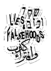
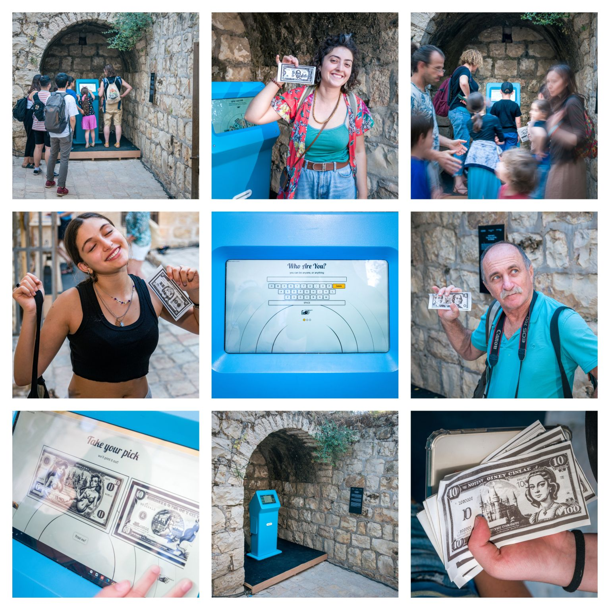

---
title: "My Jerusalem Design Week Web App"
date: "2023-10-11"
description: "AppDevelopment| JDW2023| NodeJS"
--- 

# Reflection on Jerusalem Design Week 2023 (22-29.6)

"Nothing happens twice. That's why we were born without any preparation. And we will die without routine." - Wisława Szymborska

Banknotes are a symbol from the beginning of civilization and accompany us even further.

What would happen if everyone issued their own value?

Yonatan Assouline, Ben Drusinsky and I got the opportunity to work on this experiment for the Jerusalem Design Week 2023 (JDW) - https://lnkd.in/dkRJiBgp

I was honored to be selected as this project's software programmer.

My decision to use Node.js for coding the project was based on completing an online course and reading some relevant books on it.

For the visual image, Stable Diffusion (a deep learning, text-to-image model) was used, and Chat GPT (what else) was used for the quote embedding.

This app has contributed to the success of JDW 2023 and was very well-received by the users.

It was a pleasure to be a part of Jerusalem Design week, and we were thankful for the opportunity to display our work and project there.

Lastly, I would like to thank every member of my team who worked on the project - without you nothing would have been possible.

You are invited to check out the WebApp and encouraged to give feedback on the project.
www.yourownbill.com

Currently, we are in the go to market phase with this system.

Documenting and photographing by the photographer - Daniel Rahamim during the design week.

#AppDevelopment, #JDW2023, #NodeJS